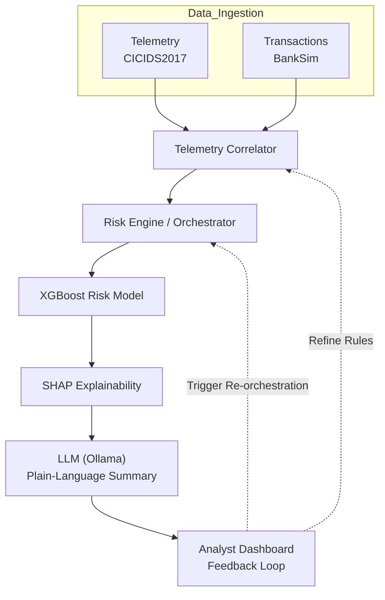

# AegisX

AI-driven correlation engine for banking cybersecurity — connecting network telemetry to transactional behaviour to catch threats a single-signal system would miss.

## Problem

Banking security teams typically monitor network telemetry (intrusion detection, session logs) and transactional behaviour (fraud/risk scoring) as two separate pipelines, watched by two separate teams. An attacker who blends in on both signals individually — a slow-and-low recon scan paired with a transaction that looks routine on its own — can slip through undetected because nobody is correlating the two streams in real time. Analysts are also left with black-box risk scores they can't explain or act on quickly, and most systems have no answer for the looming risk of "harvest now, decrypt later" attacks against current encryption.

## Solution

AegisX fuses network telemetry and transactional behaviour into a single correlated risk pipeline, explains every flag in plain language, learns from analyst feedback, and scores exposure to future quantum decryption risk — all in one system instead of stitched-together tools.

## Features

- **Live Threat Correlation** — cross-references live telemetry events against transactional behaviour in real time to catch coordinated attack patterns that look benign on either signal alone
- **Session Reconstruction** — rebuilds the full sequence of an attacker's session from fragmented telemetry events into a single readable timeline
- **Explainable AI (SHAP + LLM)** — every risk score is broken down feature-by-feature with SHAP, then summarized into a plain-language explanation by a local LLM, so analysts don't have to interpret raw model output
- **Analyst Feedback Loop** — analysts can confirm or dismiss flags, feeding back into the system to reduce false positives over time
- **Post-Quantum Risk Scoring** — flags transactions/sessions with the highest exposure to future "harvest now, decrypt later" quantum decryption risk
- **Proactive Telemetry Detection** — surfaces early-stage recon and intrusion patterns (e.g. port scans, brute-force attempts) before they escalate into a confirmed breach

## Tech Stack

- **Risk Engine / Orchestrator** — coordinates the correlation pipeline end to end
- **Telemetry Correlator** — fuses network telemetry with transactional data
- **XGBoost** — core risk classification model
- **SHAP** — feature-level explainability on top of model output
- **LLM (Ollama, local)** — turns SHAP output into plain-language analyst summaries
- **Quantum-Proof Cryptography module** — post-quantum / HNDL risk scoring
- Data: [BankSim](https://github.com/EdgarLopezPhD/PaySim) (simulated transactions) fused with [CICIDS2017](https://www.unb.ca/cic/datasets/ids-2017.html) (real intrusion telemetry) via a synthetic identity/linkage layer

## Architecture



Quantum-Proof Cryptography module runs alongside the main pipeline, scoring sessions/transactions for post-quantum ("harvest now, decrypt later") exposure.

## Installation

```bash
git clone https://github.com/<your-username>/aegisx.git
cd aegisx
python -m venv .venv
source .venv/bin/activate   # Windows: .venv\Scripts\activate
pip install -r requirements.txt
```

Set up any required local model (Ollama) per its own docs before running the app.

Run:

```bash
streamlit run app.py
```

## Demo


The repository includes a seeded demo database (15 sample alerts, 4 analyst feedback logs) so the app is populated and demoable immediately after cloning — no manual data setup required.

## Future Work

- Real-time streaming ingestion instead of batch-simulated telemetry/transaction feeds
- Expanded post-quantum risk scoring against a wider range of cryptographic primitives
- Role-based access control (current login screen is a UI mock, not yet functional)
- Deployment-ready configuration for production banking environments

## License

MIT — see [LICENSE](LICENSE)
