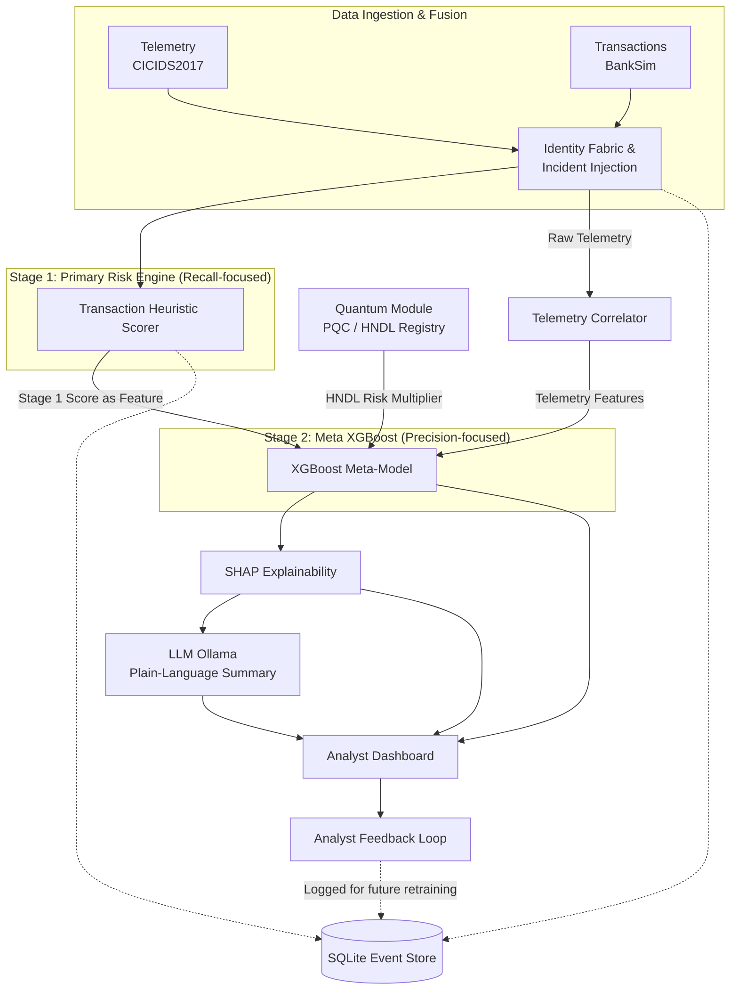

# AegisX

AI-driven correlation engine for banking cybersecurity — connecting network telemetry to transactional behaviour to catch threats a single-signal system would miss.

## Problem

Banking security teams typically monitor network telemetry (intrusion detection, session logs) and transactional behaviour (fraud/risk scoring) as two separate pipelines, watched by two separate teams. An attacker who blends in on both signals individually — a slow-and-low recon scan paired with a transaction that looks routine on its own — can slip through undetected because nobody is correlating the two streams in real time. Analysts are also left with black-box risk scores they can't explain or act on quickly, and most systems have no answer for the looming risk of "harvest now, decrypt later" attacks against current encryption.

## Solution

AegisX fuses network telemetry and transactional behaviour into a single correlated risk pipeline, explains every flag in plain language, learns from analyst feedback, and scores exposure to future quantum decryption risk — all in one system instead of stitched-together tools.

Detection runs as a **two-stage pipeline**: a fast, transparent, recall-focused first pass catches every transaction worth a second look, and a precision-focused correlation stage — fusing telemetry, transaction, and quantum-exposure signal — narrows that down to the alerts actually worth an analyst's time.

## Features

- **Two-Stage Threat Correlation** — a recall-focused Primary Risk Engine flags every transaction worth a second look; a precision-focused Meta XGBoost model then fuses that flag with live telemetry and transactional context to filter out the noise, catching coordinated attack patterns that look benign on either signal alone
- **Session Reconstruction** — rebuilds the full sequence of an attacker's session from fragmented telemetry events into a single readable timeline
- **Explainable AI (SHAP + LLM)** — every risk score is broken down feature-by-feature with SHAP, then summarized into a plain-language explanation by a local LLM, so analysts don't have to interpret raw model output
- **Analyst Feedback Loop** — analysts can confirm or dismiss flags, feeding back into the system to reduce false positives over time
- **Post-Quantum Risk Scoring, Fused Into the Score** — sessions touching assets flagged for "harvest now, decrypt later" exposure carry a real, weighted increase in their composite risk score — quantum exposure is a direct input to detection, not a separate report sitting next to it
- **Proactive Telemetry Detection** — surfaces early-stage recon and intrusion patterns (e.g. port scans, brute-force attempts) before they escalate into a confirmed breach, even with no transaction attached yet

## Tech Stack

- **Stage 1 — Primary Risk Engine** — a transparent, rule-based heuristic over transaction-only features (amount, frequency, merchant risk category), tuned for high recall
- **Stage 2 — Meta XGBoost Model** — consumes the Stage 1 score alongside telemetry features and quantum-exposure signal to produce the final, precision-focused composite threat score
- **Risk Engine / Orchestrator** — coordinates the correlation pipeline end to end
- **Telemetry Correlator** — fuses network telemetry with transactional data
- **SHAP** — feature-level explainability on top of Stage 2's output
- **LLM (Ollama, local)** — turns SHAP output into plain-language analyst summaries
- **Quantum-Proof Cryptography module** — maintains the post-quantum / HNDL exposure registry that feeds Stage 2's risk multiplier
- Data: BankSim (simulated transactions) fused with CICIDS2017 (real intrusion telemetry) via a synthetic identity/linkage layer — see [Datasets](#datasets) below

## Datasets

| Dataset | Purpose | Link |
|---|---|---|
| **BankSim** | Agent-based bank payment simulator calibrated on aggregated real banking behaviour — provides realistic customer transaction distributions and fraud labels | [kaggle.com/datasets/ealaxi/banksim1](https://www.kaggle.com/datasets/ealaxi/banksim1?hl=en-US) |
| **CICIDS2017** | Real, benchmark intrusion-detection dataset from the Canadian Institute for Cybersecurity — provides real attack traffic signatures (brute force, web attacks, port scans) | [unb.ca/cic/datasets/ids-2017.html](https://www.unb.ca/cic/datasets/ids-2017.html) |

Neither dataset shares a customer ID, IP space, or clock with the other — AegisX's Identity Fabric and Incident Injection layer (see Architecture below) is what links a specific CICIDS2017 attack signature to a specific BankSim customer transaction. The linkage itself is synthetic; the transaction behaviour and attack signatures underneath it are both drawn from real data.

## Acknowledgments

AegisX would not exist without the researchers and institutions behind the two datasets it's built on:

- **[BankSim](https://www.kaggle.com/datasets/ealaxi/banksim1?hl=en-US)** — an agent-based simulation of bank payments, developed by Edgar Alonso Lopez-Rojas and colleagues, calibrated on aggregated real transaction data from a bank in Spain. Thank you for making a realistic, privacy-preserving financial fraud dataset publicly available to the research and developer community.
- **[CICIDS2017](https://www.unb.ca/cic/datasets/ids-2017.html)** — a real, labeled intrusion-detection benchmark developed by the Canadian Institute for Cybersecurity (CIC) at the University of New Brunswick. Thank you for providing a rigorously constructed, freely accessible dataset of real attack traffic that made the network telemetry side of this project possible.

We're grateful to both teams for the work that went into building and sharing these datasets — this project simply wouldn't have real data to correlate without them.

## Architecture



Stage 1 is deliberately noisy — it exists to make sure nothing suspicious is missed before richer context is applied. Stage 2 brings precision back up by fusing in telemetry and quantum-exposure signal, which is also where the false-positive reduction actually happens: the gap between Stage 1's alert volume and Stage 2's filtered output is the concrete, measurable mechanism behind that number, not just a headline stat.

## Installation

```bash
git clone https://github.com/<your-username>/aegisx.git
cd aegisx
python -m venv .venv
source .venv/bin/activate   # Windows: .venv\Scripts\activate
pip install -r requirements.txt
```

Set up any required local model (Ollama) per its own docs before running the app.

Run:

```bash
streamlit run app.py
```

## Demo

The repository includes a seeded demo database (15 sample alerts, 4 analyst feedback logs) so the app is populated and demoable immediately after cloning — no manual data setup required.

## Future Work

- Real-time streaming ingestion instead of batch-simulated telemetry/transaction feeds
- Expanded post-quantum risk scoring against a wider range of cryptographic primitives
- Role-based access control (current login screen is a UI mock, not yet functional)
- Deployment-ready configuration for production banking environments

## License

MIT — see [LICENSE](LICENSE)
