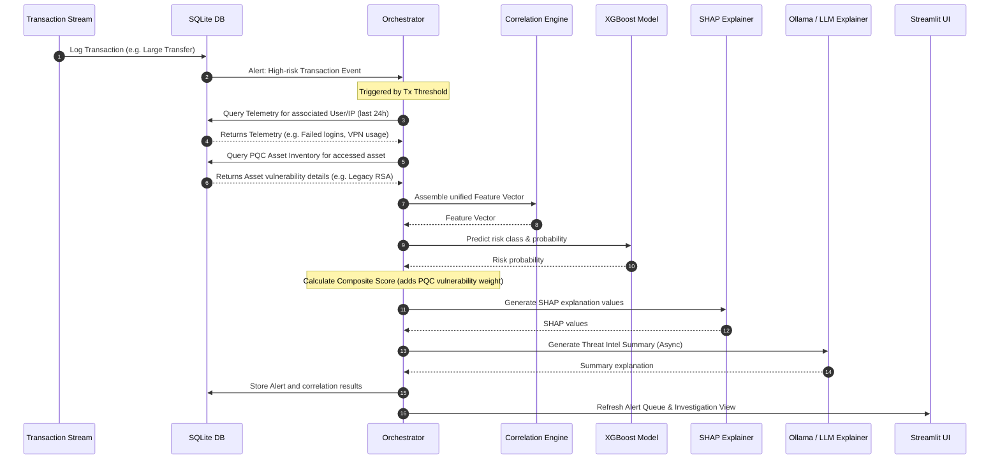
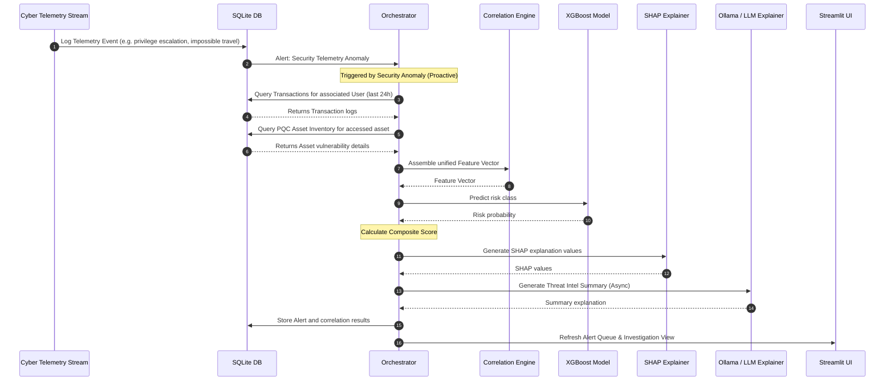

# AegisX Implementation Plan: AI-Driven Cyber-Transaction Correlation

This plan details the implementation of **AegisX**, focusing on correlating cybersecurity telemetry and transactional behaviour to identify threats, reduce false positives, and provide explainable AI insights.

---

## Architecture & Orchestration Model

The core value proposition of AegisX is its **Orchestration Model** that fuses cyber telemetry, transactional events, and quantum vulnerability signals, triggering analysis from both transaction-side and telemetry-side anomalies.

### Architectural Diagram (Mermaid)

```mermaid
graph TD
    %% Input Sources
    subgraph Data Sources
        TxSource[Transaction Stream]
        SecSource[Cyber Security Telemetry]
        QSource[PQC Asset Inventory]
    end

    %% Storage
    subgraph SQLite Database
        TxTable[(Transaction Logs)]
        SecTable[(Telemetry Logs)]
        QTable[(PQC Inventory)]
        FeedbackTable[(Analyst Feedback)]
        LogTable[(System Error Log)]
    end

    %% Routing Data
    TxSource --> TxTable
    SecSource --> SecTable
    QSource --> QTable

    %% Dual Triggers
    subgraph Orchestrator (The Brain)
        direction TB
        TriggerA[Path A: Transaction-First Trigger]
        TriggerB[Path B: Telemetry-First Trigger]
        
        TxTable -.->|Threshold Breach| TriggerA
        SecTable -.->|Security Anomaly| TriggerB
        
        Correlator[Security Correlation Engine]
        
        TriggerA -->|Fetch matching Telemetry| Correlator
        TriggerB -->|Fetch matching Transactions| Correlator
        QTable -.->|Check Asset Vulnerability| Correlator
    end

    %% Scoring and AI Pipeline
    subgraph Risk Analysis & XAI
        FeatureVec[Unified Feature Vector]
        XGB[XGBoost Meta-Model]
        SHAP[SHAP Explainer]
        LLM[Explainable AI Summary]
        CompositeScore[Composite Threat Score Calculator]
    end

    Correlator --> FeatureVec
    FeatureVec --> XGB
    XGB -->|Base Threat Class| CompositeScore
    XGB --> SHAP
    SHAP --> LLM
    CompositeScore --> LLM

    %% UI and Feedback
    subgraph Dashboard UI (Streamlit)
        Login[Mock Login Screen]
        Metrics[False Positive Stats & KPIs]
        AlertQueue[Alert Queue]
        Details[Detailed Investigation View]
        SHAPWidget[SHAP Graph Widget]
        LLMWidget[LLM Summary Text]
        Feedback[Feedback Loop Buttons]
    end

    CompositeScore --> AlertQueue
    SHAP --> SHAPWidget
    LLM --> LLMWidget
    Feedback --> FeedbackTable

    %% Error Handler
    LogTable -.-> DashboardUI
```

### Orchestration Models: Trigger Pathways

#### 1. Path A: Transaction-First Orchestration


#### 2. Path B: Telemetry-First Orchestration (Proactive)


---

## User Review Required

> [!IMPORTANT]
> **Dependencies**: The SHAP library requires compilation of C++ extensions on some platforms. If standard installation fails, we will use a pure-Python fallback SHAP approximation model or pre-calculated feature importance mapping to ensure 100% demo stability without breaking the Streamlit dashboard runtime.

> [!IMPORTANT]
> **Local LLM**: Ollama is installed but does not have any models loaded. We will include a config parameter to pull `qwen2:0.5b` or `gemma2:2b`. In case Ollama is not running/accessible, we will build a robust template-based rule generator fallback that generates the exact explanation text without failing the pipeline.

---

## Open Questions

- *None at this stage. The requirements are fully detailed in `bible.md` and the environment constraints are clear.*

---

## Proposed Changes

We will build the codebase from scratch in `/Users/kriii/Desktop/aegisX/`.

### Component 1: Data and Model Setup

#### [NEW] [schema.sql](file:///Users/kriii/Desktop/aegisX/schema.sql)
Defines the SQLite tables:
- `transactions`: ID, timestamp, user_id, amount, merchant, country, card_present, risk_score.
- `telemetry`: ID, timestamp, user_id, event_type (login_failed, vpn_used, privilege_escalation, impossible_travel), source_ip, device_id, asset_id.
- `pqc_inventory`: asset_id, asset_name, algorithm (RSA-2048, ECC-256, Kyber-512), pqc_compliant (0/1), data_classification (HNDL, confidential, public).
- `alerts`: ID, trigger_type (transaction/telemetry), timestamp, user_id, composite_score, status (New/Investigating/Resolved), xgb_score, pqc_bump, shap_values_json, llm_summary.
- `feedback`: alert_id, status (True Threat / False Positive), analyst_notes, timestamp.
- `error_logs`: ID, timestamp, module, error_message, stack_trace.

#### [NEW] [error_logger.py](file:///Users/kriii/Desktop/aegisX/error_logger.py)
A module to catch and log errors to `error_logs` table and a local `error.log` file, ensuring robust diagnostics.

#### [NEW] [generator.py](file:///Users/kriii/Desktop/aegisX/generator.py)
Synthetic data generator that:
- Populates PQC asset inventory.
- Generates base transaction and telemetry noise.
- Inject *correlated attack graphs* to demo dual-path triggers:
  - *Pattern 1 (Transaction-first)*: User has 3 failed logins, switches to a new VPN IP, then executes a large transfer.
  - *Pattern 2 (Telemetry-first / Proactive)*: User performs privilege escalation on a legacy RSA-2048 endpoint flagged as HNDL, but doesn't make a transaction yet.
  - *Pattern 3 (False Positive Reduction)*: A large transfer from a recognized user on their usual device/IP with clean telemetry (high transaction risk but zero telemetry risk, classified as false positive by XGBoost).

#### [NEW] [model_trainer.py](file:///Users/kriii/Desktop/aegisX/model_trainer.py)
Trains the XGBoost meta-model on synthetic data:
- Features: `amount`, `hour_of_day`, `failed_logins_count`, `vpn_active`, `impossible_travel_detected`, `priv_escalation_detected`, `legacy_crypto_accessed`.
- Target: `is_threat` (correlated attack patterns = 1, normal transactions or isolated high-amount = 0).
- Saves model to `xgboost_model.json`.

---

### Component 2: Orchestration & Explainability

#### [NEW] [orchestrator.py](file:///Users/kriii/Desktop/aegisX/orchestrator.py)
The system core:
- Listens for raw transactions or telemetry anomalies.
- Triggers correlation logic: pulls security telemetry, transaction logs, and PQC asset vulnerability.
- Assembles feature vectors.
- Invokes the XGBoost model.
- Applies Post-Quantum vulnerability score bump (+15% if telemetry asset is flagged HNDL-vulnerable).
- Generates SHAP explanation values.
- Asynchronously queries Ollama (or falls back to built-in template generator) for threat summary.
- Logs any failures gracefully to `error_logger`.

---

### Component 3: User Interface

#### [NEW] [app.py](file:///Users/kriii/Desktop/aegisX/app.py)
Streamlit application incorporating:
- **Mock Login Screen**: Simple static username/password gateway.
- **Main Dashboard Dashboard**:
  - Live metric widgets (Alerts, False Positives Filtered, Active Threats, High Quantum Risk Assets).
  - Prominent false positive reduction rate percentage.
- **Real-time Alert Queue**: Table displaying active alerts, sorted by threat score.
- **Investigation Panel**:
  - Selected alert breakdown: transaction details, telemetry history, and quantum readiness indicator.
  - Interactive SHAP graph (force/bar plot using matplotlib or streamlit components).
  - LLM Correlation Summary text box.
  - Action buttons: ✓ True Threat / ✗ False Positive (stores feedback in DB).
- **Quantum Inventory Analyzer Tab**: List of PQC compliance by assets.

---

## Verification Plan

### Automated Tests
- Run synthetic data generation script.
- Verify model training script compiles and outputs the XGBoost model files.
- Verify database queries function correctly.

### Manual Verification
- Launch Streamlit dashboard.
- Walk through mock login.
- Verify alert queue displays both transaction-first and telemetry-first triggers.
- Click an alert to inspect: verify SHAP charts and LLM summaries load.
- Submit feedback and confirm it updates the feedback log database.
- View error logs and verify any mock errors display correctly.
